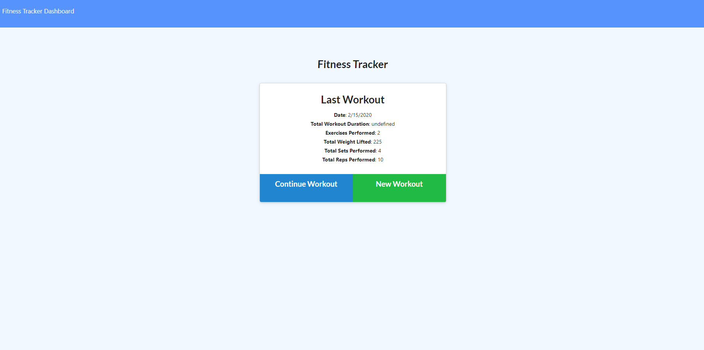

# getPhysical

## User Story
- The ideal user for this application is someone wanting a fitness tracker for long term use. The Get Physical Fitness tracker utilizes a MongoDB database to track either resistance or cardio based workouts. 

## Summary of Project
- From the landing page the user has the option to either create a new workout or work within the current workout (ie. current day/session)

- The user then can enter the workout they have specified and continue back the the landing page.

- In the upper left conner the user can click on the dashboard link to take them to the current dashboard, that displays workout minutes, pounds lifted, and exercises performed/

## Link to Deployed Project
https://arcane-badlands-04919.herokuapp.com/